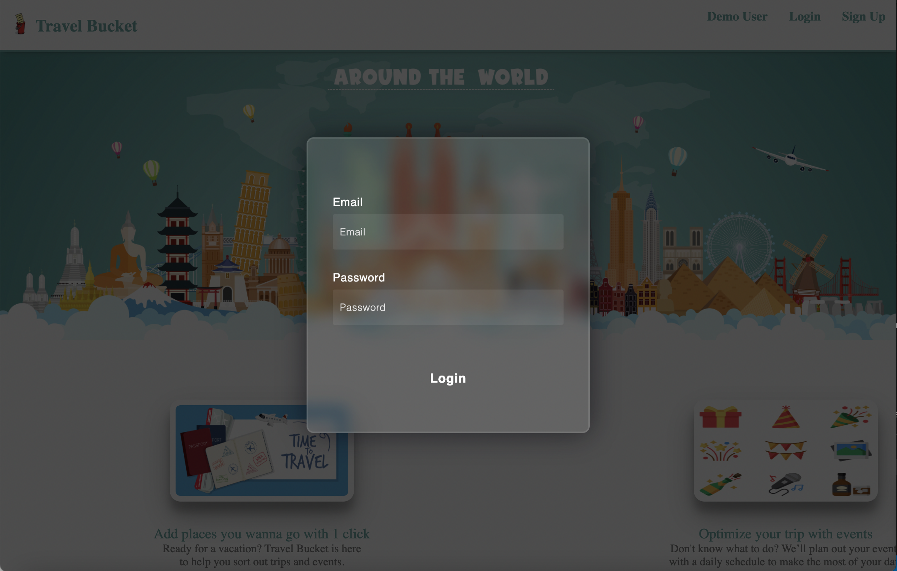
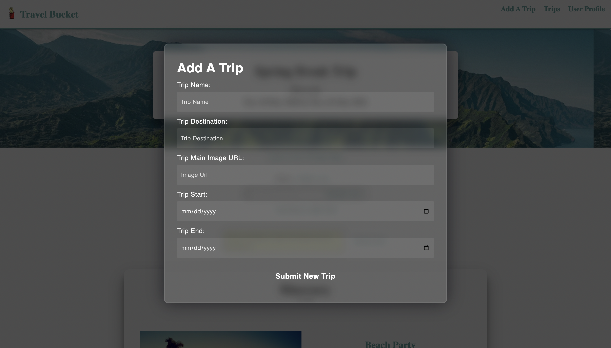
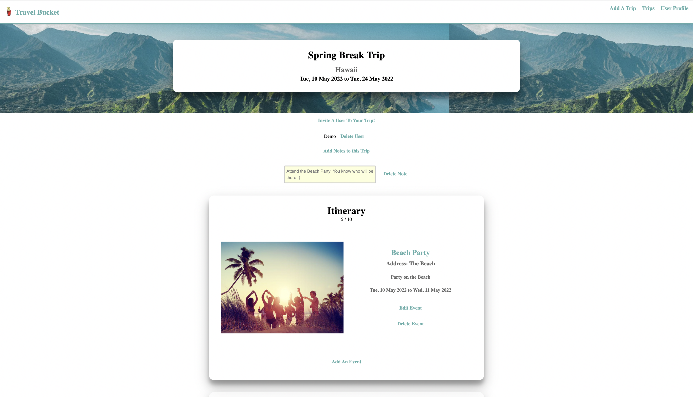
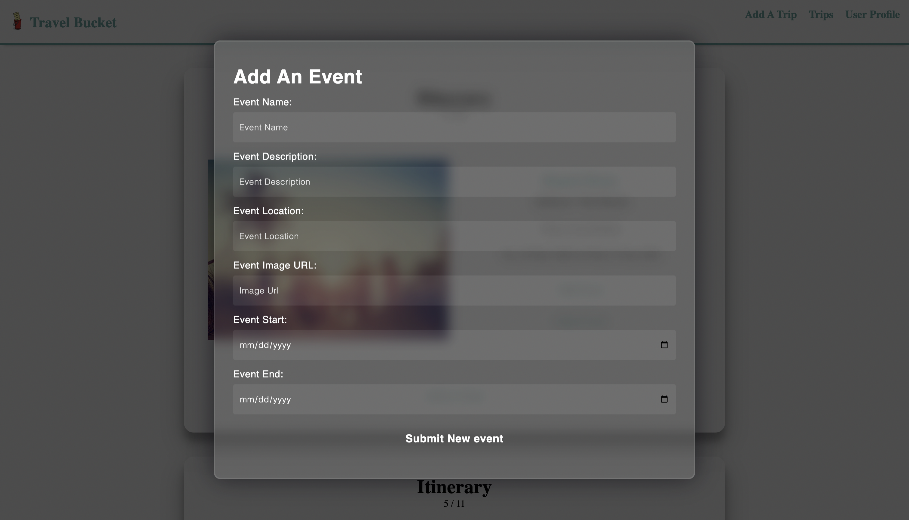
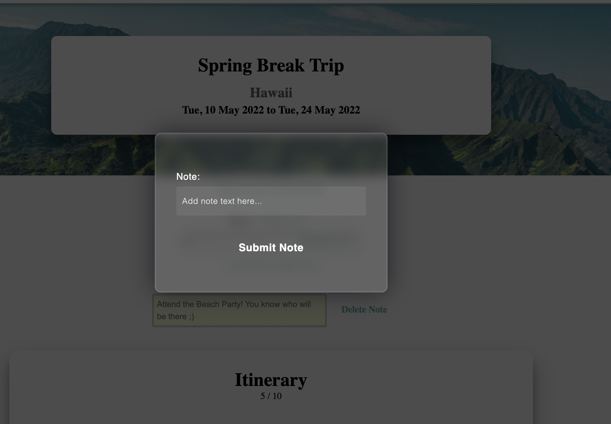
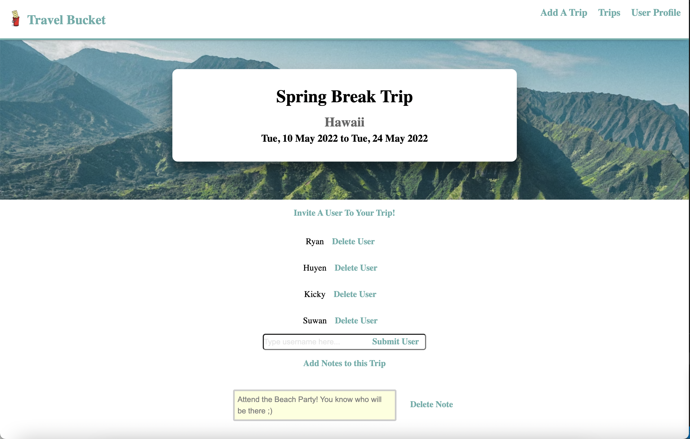
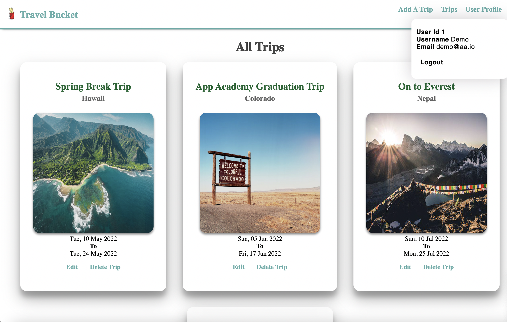

<div id="top"></div>

<!-- PROJECT LOGO -->
<br />
<div align="center">
  <a href="https://travel-bucket-app.herokuapp.com">
    
  </a>

<h3 align="center">Travel Bucket</h3>

  <p align="center">
    A portfolio clone of Wanderlog
    <br />
    <a href="https://travel-bucket-app.herokuapp.com/"><strong>Explore the website »</strong></a>
    <br />
  </p>
</div>


<!-- TABLE OF CONTENTS -->
<details>
  <summary>Table of Contents</summary>
  <ol>
    <li>
      <a href="#about-the-project">About The Project</a>
      <ul>
        <li><a href="#key-features">Key Features</a></li>
      </ul>
    </li>
    <li><a href="#build-with">Built With</a></li>
    <li><a href="#usage">Usage</a></li>
    <li><a href="#contact">Contact</a></li>
  </ol>
</details>


<!-- ABOUT THE PROJECT -->
## About The Project

Travel Bucket, a Wanderlog clone, is a travel planning website for users to customize their own trip based on destination and available dates. Users are also able to add, edit, and delete any places/events to visit during the day; able to add, delete any notes for the trip; and share the trip with other users. Make vacation planning a lot more useful and fun!

 


**Key Features**
* Create new users and have user login with authorization
* Post, edit, and delete trips and events whith the trip that login users own
* Share the trip with other users
* Post, and delete notes within the trip


<p align="right">(<a href="#top">back to top</a>)</p>


<!-- BUILT WITH -->
## Built With

* [Javascript](https://www.javascript.com)
* [PostgreSQL](https://www.postgresql.org/docs/)
* [Heroku](https://www.heroku.com)
* [Flask](https://flask.palletsprojects.com/en/2.1.x/)
* [SQLAlchemy](https://www.sqlalchemy.org/)
* [React](https://reactjs.org/)
* [CSS](https://developer.mozilla.org/en-US/docs/Web/CSS)


<p align="right">(<a href="#top">back to top</a>)</p>


<!-- USAGE EXAMPLES -->
## Usage

* Users can signup and login to use Travel Bucket, and can login as a demo user to experience the website quickly.

 


* Once logged in, the user is directed to the main trip page, where logged-in users can view a list of trips the user owns based on time created.

 


* Logged in users can create a new trip. It can also be edited and deleted.

 


* Logged in user can click into any individual trip, to see all created events based on the iternary, notes for the entire trip, as well as other invited user.

 


* Same as creating a trip, logged in users can also create a new event, as well as to edit and delete.

 


* And to create and delete note.

 


* Users can invite other users into the trip.




* Users can click into user's profile page to view their information.




<p align="right">(<a href="#top">back to top</a>)</p>


## Getting started
1. Clone this repository (only this branch)

   ```bash
   git clone https://github.com/YinYang117/Travel-Bucket.git
   ```

2. Install dependencies

      ```bash
      pipenv install --dev -r dev-requirements.txt && pipenv install -r requirements.txt
      ```

3. Create a **.env** file based on the example with proper settings for your development environment

4. Setup your PostgreSQL user, password and database and make sure it matches your **.env** file

5. Get into your pipenv, migrate your database, seed your database, and run your flask app

   ```bash
   pipenv shell
   ```

   ```bash
   flask db upgrade
   ```

   ```bash
   flask seed all
   ```

   ```bash
   flask run
   ```

6. To run the React App in development, checkout the [README](./react-app/README.md) inside the `react-app` directory.

***


*IMPORTANT!*
   psycopg2-binary MUST remain a dev dependency because you can't install it on apline-linux.
   There is a layer in the Dockerfile that will install psycopg2 (not binary) for us.
***

### Dev Containers (Option for M1 Users)

1. Make sure you have the [Microsoft Remote - Containers](https://marketplace.visualstudio.com/items?itemName=ms-vscode-remote.remote-containers) extension installed.
2. Make sure you have [Docker](https://www.docker.com/products/docker-desktop/) installed on your computer.
3. Clone the repository (only this branch)
   ```bash
   git clone https://github.com/YinYang117/Travel-Bucket.git
   ```
4. Open the repo in VS Code.
5. Click "Open in Container" when VS Code prompts to open container in the bottom right hand corner.
6. **Be Patient!** The initial install will take a LONG time, it's building a container that has postgres preconfigured and even installing all your project dependencies. (For both flask and react!)

   **Note:** This will take much less time on future starts because everything will be cached.

7. Once everything is up, be sure to make a `.env` file based on `.env.example` in both the root directory and the *react-app* directory before running your app.

   ```bash
   npm install
   ```

   ```bash
   npm start
   ```

8. Get into your pipenv, migrate your database, seed your database, and run your flask app

   ```bash
   pipenv shell
   ```

   ```bash
   flask db upgrade
   ```

   ```bash
   flask seed all
   ```

   ```bash
   flask run
   ```

9. To run the React App in development, checkout the [README](./react-app/README.md) inside the `react-app` directory.

<br>


## Helpful commands
|    Command            |    Purpose    |
| -------------         | ------------- |
| `pipenv shell`        | Open your terminal in the virtual environment and be able to run flask commands without a prefix |
| `pipenv run`          | Run a command from the context of the virtual environment without actually entering into it. You can use this as a prefix for flask commands  |
| `flask db upgrade`    | Check in with the database and run any needed migrations  |
| `flask db downgrade`  | Check in with the database and revert any needed migrations  |
| `flask seed all`      | Just a helpful syntax to run queries against the db to seed data. See the **app/seeds** folder for reference and more details |
| `heroku login -i`      | Authenticate your heroku-cli using the command line. Drop the -i to authenticate via the browser |
| `heroku authorizations:create` | Once authenticated, use this to generate an Oauth token |
| `heroku run -a travel-bucket-app` | Run a command from within the deployed container on Heroku |


<!-- CONTACT -->
## Contact

Huyen Nguyen - [GitHub](https://github.com/huyennguuyen)

Kicky Liu - [GitHub](https://github.com/kickylau)


Ryan Schneider - [GitHub](https://github.com/YinYang117)

Suwanshree Acharya - [GitHub](https://github.com/suwanshree)


Project Repo Link: [https://github.com/YinYang117/Travel-Bucket](https://github.com/YinYang117/Travel-Bucket)

Project Link: [https://travel-bucket-app.herokuapp.com/](https://travel-bucket-app.herokuapp.com/)

<p align="right">(<a href="#top">back to top</a>)</p>
